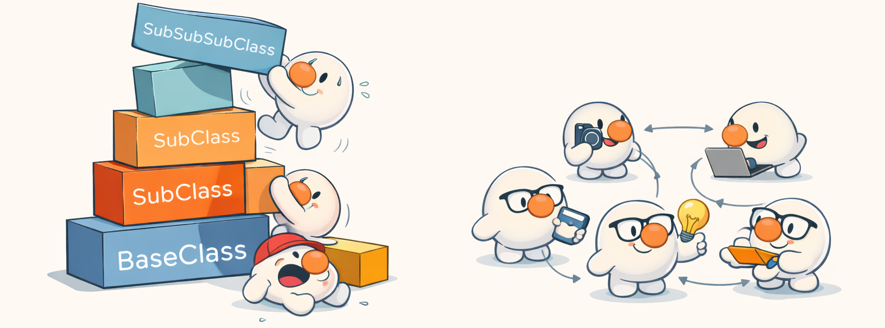

# Prototype-Based Languages: A Different Way to Think

> "The most dangerous thing you can do is to think you understand something when you do not." — David Ungar

## Introduction

Prototype-based languages offer a radically different mental model from class-based object-oriented programming. Instead of defining abstract blueprints (classes) and instantiating them, prototype-based systems work directly with concrete objects that can be cloned, extended, and reshaped at runtime.

This article explores what a prototype-based language brings conceptually, why this paradigm has enduring value, **where it comes from historically**, and how **ProtoScript** provides a clean, minimal, and pedagogical way to rediscover the foundations of JavaScript—without the historical baggage.

The goal is not only to *use* a prototype-based language, but to **understand it, master it, and eventually enjoy it**.

---

## A Brief but Fascinating History of Prototype-Based Languages

Prototype-based programming did not emerge as an accident or a shortcut. It was a deliberate response to perceived limits of class-based object-oriented systems.

### The Origin: Self (mid-1980s)

The first true prototype-based language is **Self**, designed in the mid-1980s by **David Ungar** and **Randall Smith** at Xerox PARC and later at Stanford.

Self made a radical statement:

- No classes at all
- Only objects
- Objects clone other objects
- Inheritance replaced by delegation

The goal was conceptual purity and cognitive simplicity. Self demonstrated that classes were not essential to object-oriented programming.

### Why Prototypes Were Invented

At the time, class-based OO (Smalltalk, C++, later Java) suffered from:

- Deep inheritance hierarchies
- Premature abstraction
- Artificial type taxonomies

Prototypes were introduced to allow:

- Incremental design
- Concrete-first thinking
- Late abstraction

In other words: *programming by growth rather than by decree*.

### Other Prototype-Based Languages

Following Self, several languages adopted or experimented with prototype-based models:

- **NewtonScript** (Apple, early 1990s): used in the Newton PDA, showing prototypes could work in production systems.
- **Io** (2002): a minimalist, message-passing, prototype-based language focused on elegance and reflection.
- **Lua** (1993): not purely prototype-based, but heavily prototype-inspired via tables and metatables.
- **REBOL**: blended prototype ideas with data-driven programming.

Each explored different trade-offs, but all rejected rigid class hierarchies.

### JavaScript: The Accidental Revolutionary (1995)

JavaScript, created by **Brendan Eich** in 1995, brought prototype-based programming to the mainstream—almost by accident.

Under severe time constraints, Eich borrowed:

- Syntax from C/Java
- First-class functions from Scheme
- Prototypes conceptually inspired by Self

The result was a language whose *surface syntax* suggested classes, but whose *core semantics* were prototype-based.

This mismatch caused decades of confusion.

### The Long Eclipse of Prototypes

As JavaScript grew, the industry attempted to "normalize" it:

- Simulating classes
- Adding `new`, constructors, and eventually `class`
- Teaching it as if it were Java

Prototype-based thinking was not rejected—it was **forgotten**.

ProtoScript exists precisely to reverse this amnesia.

---

## Why Prototypes Scared the Industry

Prototype-based languages did not disappear because they failed. They faded because they were **uncomfortable**.

Several factors contributed to industry resistance:

### 1. Global Mutation Feels Dangerous

In a prototype-based system, modifying a prototype can affect many objects instantly.

This power breaks an implicit rule of class-based culture: *behavior should be fixed once defined*.

For organizations seeking predictability, this felt risky. For poorly trained developers, it *was* risky.

The problem was not the model—but the lack of understanding and discipline.

### 2. Tooling Lagged Behind the Model

Early IDEs, debuggers, and static analyzers were designed for class hierarchies.

Prototype chains:

- Are dynamic
- Can change at runtime
- Do not fit neatly into static diagrams

Rather than adapt tooling, the industry adapted the language to the tools.

### 3. Teaching Prototypes Is Harder

Prototype-based thinking requires abandoning familiar mental shortcuts:

- No taxonomy
- No type ladder
- No compile-time guarantees

This makes it harder to teach quickly—especially in corporate environments.

Classes won by pedagogy, not by expressive power.

---

## ProtoScript vs Modern JavaScript Classes

Modern JavaScript introduced `class` syntax to reduce confusion—but at a cost.

### What `class` Solves

- Familiar syntax for class-based developers
- Easier onboarding
- Clearer intent in large teams

### What `class` Hides

- Objects are still prototype-based
- Inheritance is still delegation
- `class` is syntax sugar, not a semantic shift

This duality creates a split-brain effect: developers *write* classes but *run* prototypes.

ProtoScript refuses this compromise.

It exposes the real model directly, without disguise.



*Same goal. Different mental model.*

---

## Toward a Prototype-Based Architectural Manifesto

Prototype-based architecture demands a different discipline—not less, but **different**.

Core principles include:

- Favor shallow prototype chains
- Make mutation points explicit
- Share behavior intentionally, not accidentally
- Document prototype relationships

In this model:

- Architecture is **alive**
- Behavior can evolve safely
- Refactoring can be global and instantaneous

ProtoScript encourages architects to think in **behavioral flows**, not type hierarchies.

This is not anti-architecture.

It is architecture that accepts reality: systems evolve.

---


## 1. Objects First, Abstractions Later

In class-based languages, abstraction comes first:

- Define a class
- Define its fields and methods
- Instantiate objects

Prototype-based languages invert this flow:

- Create an object
- Use it
- Clone it
- Modify the clone

There is no conceptual gap between *definition* and *instance*. Every object is concrete, inspectable, and modifiable.

This has a profound effect on how one reasons about programs: behavior emerges by *evolution*, not by rigid design.

ProtoScript embraces this fully: objects are real values, not shadows of an abstract type.

---

## 2. Prototypes as Living Structures

A prototype is not a class. It is a **live object** used as a fallback for property lookup.

When an object does not contain a property, the lookup continues through its prototype chain. This mechanism is:

- Dynamic
- Observable
- Modifiable at runtime

In ProtoScript, prototype chains are explicit at the definition site (for example, `Car.prototype`). ProtoScript also exposes `Object.getPrototypeOf`, `Object.create`, and `Object.setPrototypeOf` for explicit inspection and changes when needed.
This encourages experimentation:

- Change a prototype
- Observe how all derived objects react
- Understand delegation instead of inheritance

This is not inheritance by taxonomy, but **inheritance by behavior sharing**.

---

## 3. Delegation Instead of Classification

Class-based systems answer the question:

> *What is this object?*

Prototype-based systems answer a different question:

> *Who can help this object do what it needs?*

This is delegation.

Objects do not *belong* to a class. They *delegate* missing behavior to another object.

ProtoScript makes this model explicit and simple, avoiding `class` syntax and meta-object confusion.

Once understood, delegation feels more natural for many real-world problems than rigid hierarchies.

---

## 4. Polymorphism Without Types

In prototype-based languages, polymorphism is structural, not nominal.

If an object responds to a message (method), it is compatible—regardless of its origin.

This leads to:

- Duck typing by construction
- Behavior-oriented design
- Fewer artificial abstractions

ProtoScript encourages this by keeping the object model minimal and transparent. There is no type system to hide behind—only behavior.

This forces clarity, but also rewards it.

---

## 5. Thinking Prototype-Based: From Agility to Acrobatic Code

Prototype-based programming is not just a syntax choice. It is a **cognitive shift**.

Instead of designing a rigid architecture up front, you start with something concrete and let structure *emerge*.

### Example 1: Specialization by Cloning

Rather than subclassing, you clone and adjust:

```
include "examples/utils/clone.js";

baseOsc = {
  freq: 440,
  play: function() { /* ... */ }
};

bassOsc = clone(baseOsc);
bassOsc.freq = 110;
```

No hierarchy. No constructor. No class explosion.

Each object tells its own story.

---

### Example 2: Behavior Injection at Runtime

You can add behavior *after* objects already exist:

```
include "examples/utils/clone.js";

filter = { cutoff: 1000 };

osc = clone(baseOsc);
osc.filter = filter;
```

Later:

```
filter.process = function(signal) { /* ... */ };
```

All objects delegating to `filter` gain the behavior instantly.

This is not just flexibility. It is **live architecture**.

---

### Example 3: Prototype Surgery (Controlled Acrobacy)

You can alter behavior deeply—but intentionally:

```
baseOsc.play = function() {
  Io.print("patched play\n");
};
```

Every derived object reacts.

This is powerful and dangerous—ProtoScript encourages understanding this mechanism rather than hiding it.

---

This is where prototype-based thinking becomes *acrobatic*: not merely agile, but capable of controlled, high‑level transformations.


*The mutation point.*

---


## 6. Prototype-Based as an Alternative to Class-Based OO

Prototype-based programming is not "OO without classes".

It is a **parallel object-oriented tradition** with different trade‑offs:

| Class-Based OO          | Prototype-Based OO     |
| ----------------------- | ---------------------- |
| Abstractions first      | Concrete objects first |
| Inheritance hierarchies | Delegation networks    |
| Compile-time structure  | Runtime structure      |
| Identity by type        | Identity by behavior   |

ProtoScript makes this distinction explicit instead of pretending prototypes are classes in disguise.

This clarity is essential for architectural reasoning.

---

## 7. Architecture in a Prototype-Based World

In prototype-based systems, architecture is:

- **Compositional**, not hierarchical
- **Behavior-driven**, not type-driven
- **Evolutive**, not frozen

Key architectural patterns include:

- Prototype libraries (objects used as behavior reservoirs)
- Trait-like objects composed by delegation
- Shallow prototype chains for predictability
- Explicit mutation points

ProtoScript’s minimalism makes these patterns visible instead of implicit.

You design *flows of behavior*, not trees of types.

---


## 7. How to Approach ProtoScript

To appreciate ProtoScript fully:

- Forget classes
- Start with concrete objects
- Clone instead of instantiating
- Modify behavior incrementally
- Observe prototype chains

Do not fight the model. Let it teach you.

Mastery comes when prototype-based thinking feels *simpler* than class-based thinking.

---

## 8. Rediscovering JavaScript’s Foundations

Modern JavaScript often hides its prototype-based nature behind `class`, transpilers, and frameworks.

ProtoScript strips all of that away.

By working with ProtoScript, you rediscover:

- What JavaScript objects really are
- How prototype chains actually work
- Why delegation was chosen historically

This understanding transfers directly back to JavaScript—but with much deeper insight.

---

## Who This Language Is Not For

ProtoScript is not designed to please everyone. This is intentional.

It is **not** the right language if:

- You want rigid guarantees enforced primarily by the compiler rather than by design discipline.
- You expect architecture to be frozen early and change rarely.
- You are uncomfortable with runtime mutation, even when explicit and controlled.
- You prefer large frameworks to define structure for you.
- You want a language that hides its execution model.

ProtoScript assumes that the developer:

- Accepts responsibility for architectural decisions.
- Wants to understand how objects really behave.
- Is willing to think before abstracting.

This is not a language for passive consumption.

---

## Conclusion

Prototype-based languages are not a curiosity. They are a **fundamental object model**.

ProtoScript is an invitation:

- To explore this model without noise
- To perform controlled architectural acrobatics
- To rethink object-oriented design beyond classes

It is also a filter.

If you are looking for comfort, it may disappoint you. If you are looking for understanding, it will reward you.

ProtoScript does not try to be popular.

It tries to be *true*.
